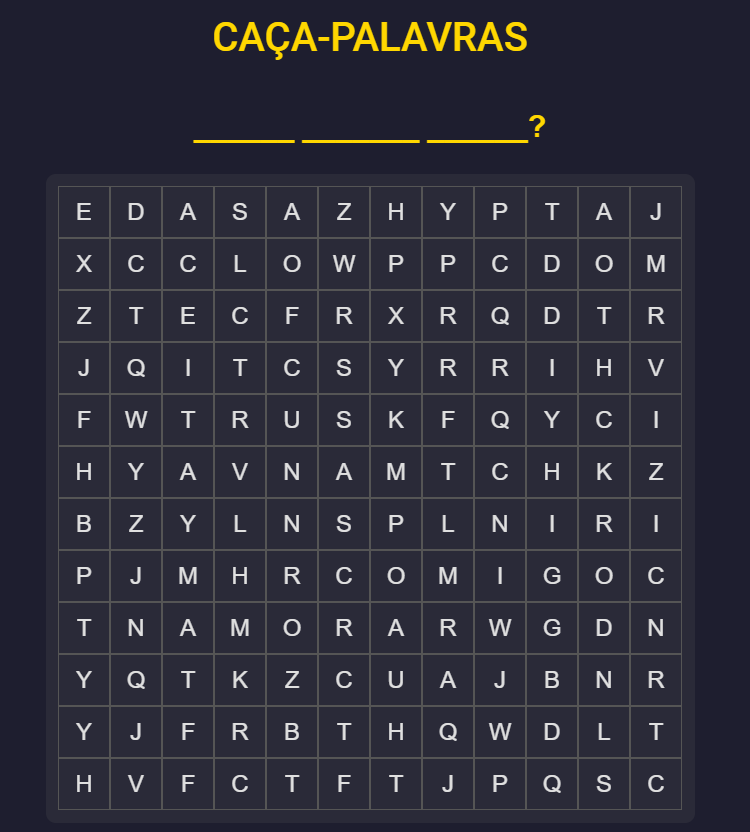

# 💌 Word Search: Aceita Namorar Comigo?

<p align="center">
  <a src="https://pedido-wheat.vercel.app/">
      
  </a>
  
</p>

This is not just another word search game... it’s a *romantic mission*! 🕵️‍♀️❤️

In this Angular-powered game, your special someone will need to find **three hidden words**:
```
ACEITA  
NAMORAR  
COMIGO
```

Once they find them all, they’ll be met with two choices:
- ✅ **SIM** — which will lead to love and happily ever after.  
- ❌ **NÃO** — *but good luck trying to click it!* 😜 (spoiler: it runs away 🏃‍♀️💨)

---

## 🚀 How to Run It Locally

1. **Clone this repo**  
   ```bash
   git clone https://github.com/leo-oliveira-eng/pedido.git
   cd pedido
   ```

2. **Install dependencies**  
   ```bash
   npm install
   ```

3. **Run the app**  
   ```bash
   ng serve
   ```
   Then open `http://localhost:4200` in your browser 💻

---

## ✨ Features

- 🔍 Word search gameplay with mouse drag support
- 🎨 Responsive design with a dark, modern vibe
- 💛 Romantic and playful interactions
- 🏃‍♂️ A “NÃO” button that’s impossible to catch
- 🥺 A heartfelt message when “SIM” is chosen
- 🎁 Built with Angular + Angular Material

---

## 📦 Want to Deploy?

You can host it anywhere static apps are welcome:
- **GitHub Pages**
- **Vercel**
- **Netlify**
- Or share it locally!

---

## 🤓 Nerdy Love FTW

This is a fun and geeky way to express your feelings through code. Whether you're a dev in love or just love fun UI interactions, this is your jam!

---

## 💘 License

MIT — Spread the love (and the code).  
But maybe personalize the message before proposing to *your* crush 😅

---

Made with ❤️ by leo-oliveira-eng  
